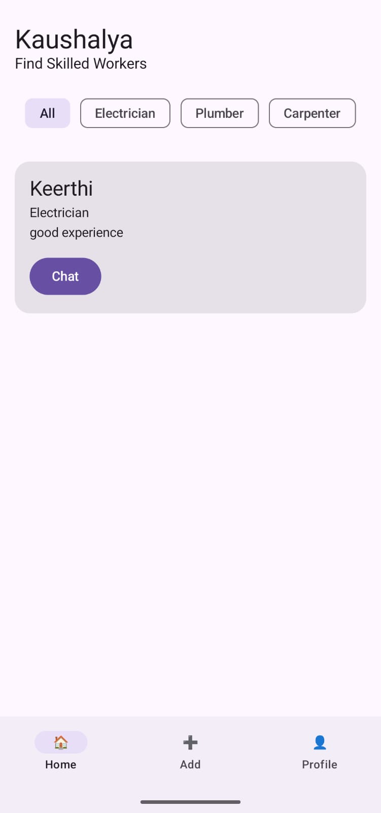
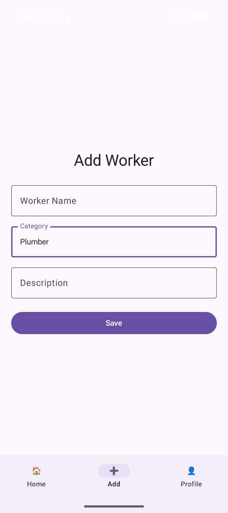

# Kaushalya App

Kaushalya is a skill-based worker marketplace Android application developed using Kotlin, Jetpack Compose, and Firebase Firestore. The application connects users with skilled workers such as electricians, plumbers, and carpenters through a modern mobile platform.

---

# Problem Statement

Finding trusted local skilled workers for household and maintenance services is difficult in many areas. The Kaushalya application was developed to simplify worker discovery, communication, and profile management through a centralized Android platform.

---

# Features

- User Registration and Login
- Firebase Firestore Integration
- Worker Listing Dashboard
- Category Filtering
- Add Worker Functionality
- Private Chat System
- Profile Management
- Real-Time Database Synchronization
- Modern UI using Jetpack Compose

---

# Technologies Used

- Kotlin
- Android Studio
- Jetpack Compose
- Firebase Firestore
- Material 3 UI
- Firebase Authentication
- Android Navigation Components

---

# Application Screenshots

## Welcome Screen


---

## Create Account Screen


---

## Login Screen


---

## Home Page



---

## Add Worker Screen



---

## Profile Settings Screen


---

# Installation Steps

1. Clone the repository

```bash
git clone https://github.com/Varshitha1245/Kaushalya_App.git
